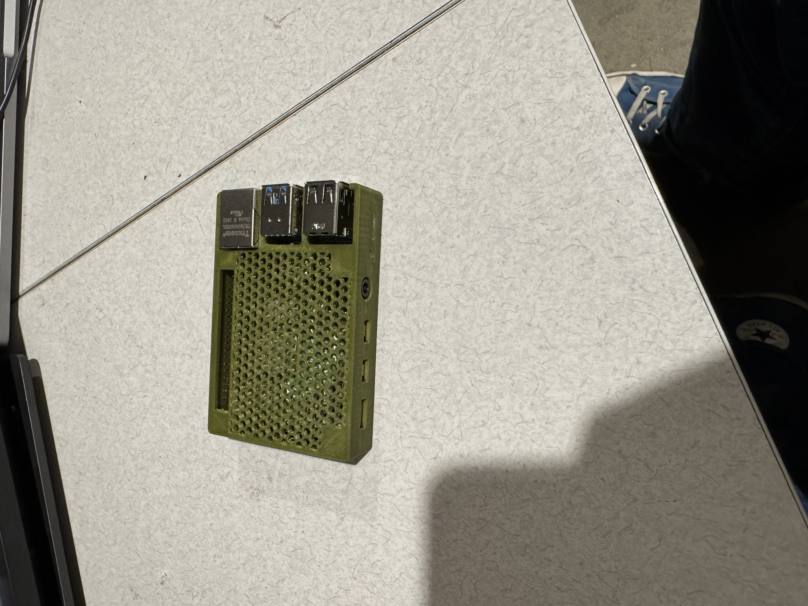
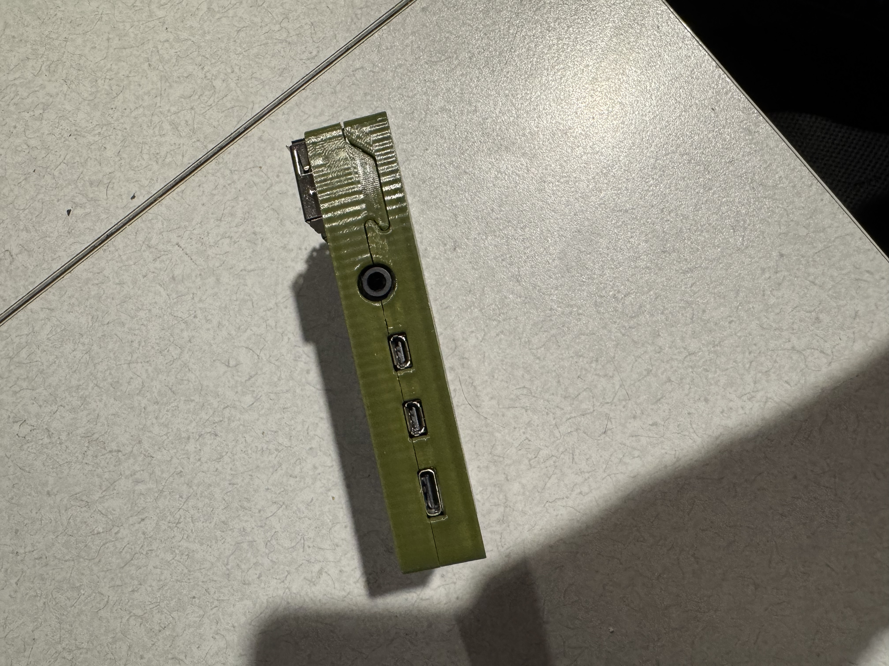

# Pi-Case
Low profile case for a raspberry pi 4b

I have printed this case well on an out-of-box bambulabs X1-C, and decently on an Ender 3 with some finnicking. I will be updating the model over time so check-in for any updates.

I have updated the case to fit together by hooks printed into 2 of the sides. This did not require any supports for printing, just some minor clean up with an exacto knife.

I printed this in PLA and they fit togther just fine, PET-G was better as it is a little more flexible. It also has a higher thermal resistance, so it will be better for higher temp use cases.

